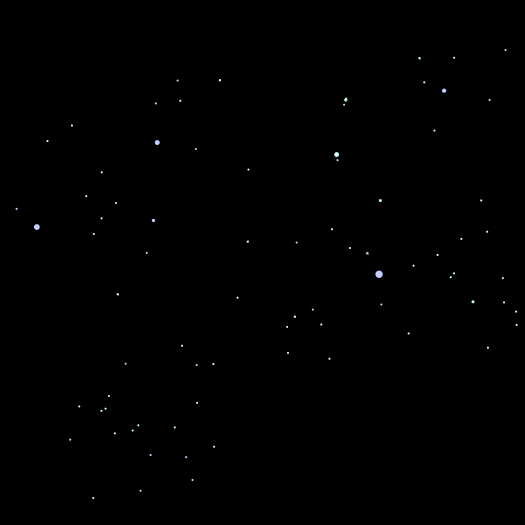
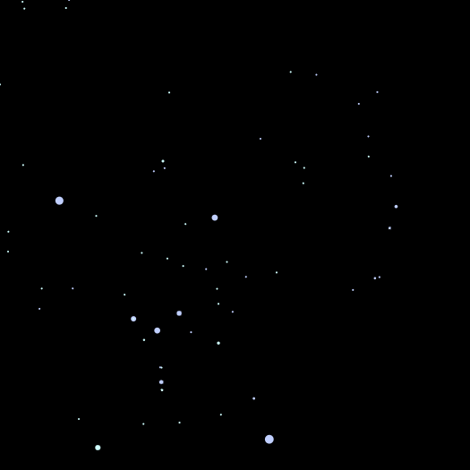

# Star-Constellation-Mapping

A simple program which maps the stars within a constellation into a **.svg** file and displays them.
The idea behind the project was from the UoE CSEE society as a summer challenge.
[CSEE Discord](https://discord.gg/AeQPaszG)

> ` availableConstellations = ["And", "Cap","Col", "Dra", "Lac", "Mus", "Psc", "Tau", "Ant", "Car", "Com", "Eql", "Leo", "Nor", "Pup", "Tel", "Aps", "Cas", "CrA" ,"Eri", "Lep", "Oct", "Pyx", "TrA", "Aql", "Cen", "CrB", "For", "Lib", "Oph","Ret", "Tri", "Aqr", "Cep", "Crt", "Gem", "LMi", "Ori", "Scl", "Tuc", "Ara","Cet",
 "Cru", "Lup", "Pav", "Sco", "UMa", "Ari", "Cha", "Crv", "Her", "Lyn", "Peg", "Sct", "UMi", "Aur", "Cir", "CVn","Hor", "Lyr","Per", "Ser","Vel", "Boo","CMa","Cyg","Hya","Men","Phe","Sex","Vir", "Cae","CMi","Del","Hyi","Mic","Pic","Sge","Vol","Cam","Cnc","Dor","Ind","Mon","PsA","Sgr", "Vul"] `

>   

The colouring of the stars in their respective constellations is calculated using the [Star Color Index](https://en.wikipedia.org/wiki/Color_index) which also tells us the estimated temperature of the star

---

## Known bugs

- [ ] Andromeda constellation doesn't display properly
- [x] Red coloured stars/red colouring on stars displays incorrectly

## Requirements to run

To run the code *properly* you have to first install the **svgwrite** library: [Mozman's svgwrite library](https://github.com/mozman/svgwrite)

To install simply go into your python directory and ` pip install svgwrite `

## Further plans

- [ ] Integrating a responsive GUI which is able to display the SVGs without the user having to navigate through their file directory

- [ ] Improving clarity of stars in image, adding possible background noise for a more realistic feel
